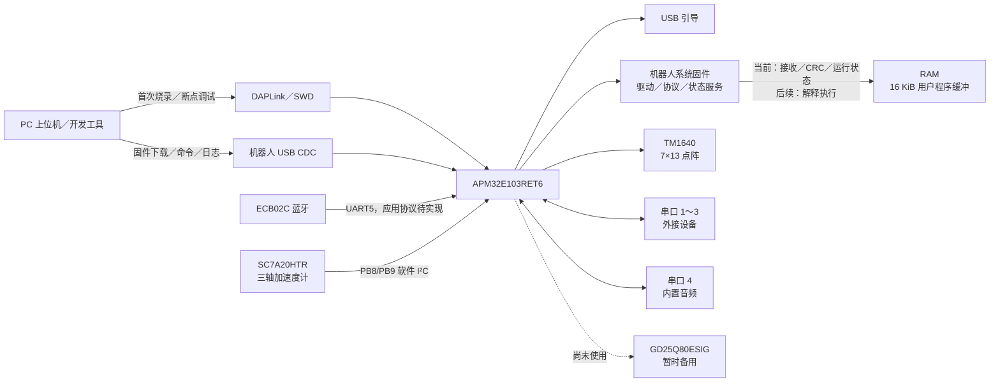
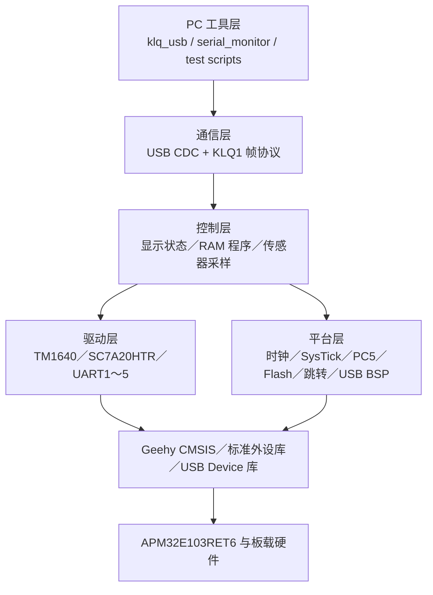
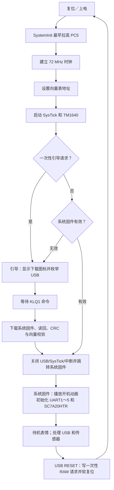
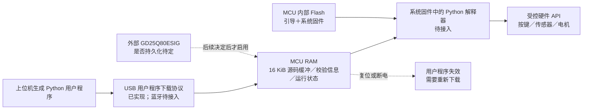
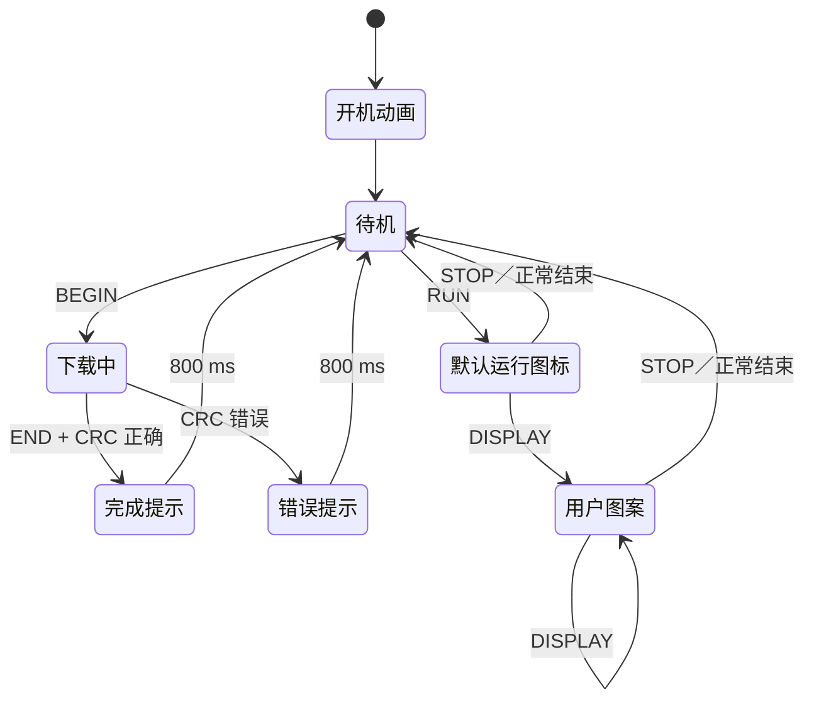
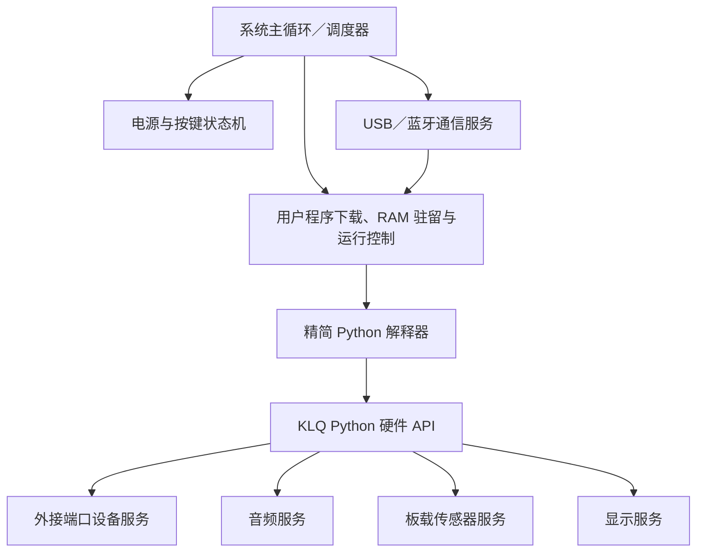

# KLQ 机器人当前架构

版本：V0.3

日期：2026-09-15

基线：2026-09-15 显示状态机、RAM 用户程序接收与自动启动版本

## 1. 文档范围

本文描述 KLQ 当前已经形成的硬件连接、固件分区、启动流程、通信链路、驱动组织和开发工具。文中的“当前实现”均可在现有源码中找到；“后续架构”用于指导下一阶段代码拆分，不表示功能已经完成。

当前系统已经具备稳定的 USB 引导、机器人系统固件下载与校验、有效固件自动启动、7×13 LED 点阵显示状态机、16 KiB RAM 用户程序接收与 CRC 校验、SC7A20HTR 采样及角度输出、五路串口基础初始化。Python 解释器、电源键业务、用户按键 API、蓝牙应用协议、外接电机／传感器协议和音频协议尚未实现；因此当前用户程序“运行”只建立运行状态和显示，不执行 Python 代码。

本文严格区分两类下载内容：机器人系统固件包含驱动、菜单、通信、解释器和系统服务，保存在 MCU 内部 Flash；上位机生成的 Python 用户程序只在 RAM 中临时驻留，不写入 MCU 内部 Flash。是否将用户程序掉电保存在外部 GD25Q80ESIG 中尚未决定。

## 2. 系统总览



机器人自身 USB 与 DAPLink 是两条独立链路。机器人 USB 当前用于系统固件升级、把用户程序送入 RAM、运行期命令和传感器日志；DAPLink 经 SWD 用于首次写入引导、Flash 读回、寄存器检查和源码级调试。

## 3. 硬件接口架构

| 功能 | MCU 接口 | 当前状态 |
| --- | --- | --- |
| 电源保持 | PC5 | 在 C 运行库初始化前拉高，整个运行期间保持高电平 |
| 电源键 | PC4 | 需求已确定为长按开／关机、短按运行／停止／菜单确认；逻辑未实现 |
| 用户按键 | PC3 | 预留给用户程序；驱动和事件接口未实现 |
| USB CDC | PA11 / PA12 | 引导和演示系统固件均已实现并实测 |
| LED 点阵 | PB6 / PB7，TM1640 | 7 行 × 13 列映射、引导图标、开机动画和系统显示状态机已实现；映射方向已实测 |
| 加速度计 | PB8 / PB9，SC7A20HTR | 软件 I²C 驱动、三轴数据和 Roll/Pitch 已实测 |
| 外接端口 1 | PA9 / PA10，USART1 | 115200、8N1 基础初始化完成 |
| 外接端口 2 | PA2 / PA3，USART2 | 115200、8N1 基础初始化完成 |
| 外接端口 3 | PB10 / PB11，USART3 | 115200、8N1 基础初始化完成 |
| 内置音频 | PC10 / PC11，UART4 | 115200、8N1 基础初始化完成；模块协议待定 |
| ECB02C 蓝牙 | PC12 / PD2，UART5；PA8 连接状态 | UART5 基础初始化完成；连接状态和应用协议未实现 |
| 电池采样 | PA0 ADC | 硬件分配已确定；采样、换算和低电量策略未实现 |
| 外部 Flash | PB12～PB15，SPI | 暂时备用；是否用于用户程序掉电保存尚未决定 |
| USB 插入检测 | PB4 | IO 表标为备用；检测逻辑未实现 |
| SC7 中断 | PB3 / PB5 | INT1/INT2 尚未使用，当前采用周期读取 |
| 调试接口 | PA13 / PA14，SWD | DAPLink 实测可用 |

## 4. 固件分层与构建模式



当前引导和演示系统固件共用 `bootloader/` 下的大部分源码，构建脚本用两种模式生成不同镜像：

| 构建命令 | 宏与链接地址 | 包含内容 |
| --- | --- | --- |
| `tools/build.py` | 无 `KLQ_DEMO_APP`；`0x08000000` | 最小引导、USB CDC、TM1640、内部 Flash 更新 |
| `tools/build.py --demo` | 定义 `KLQ_DEMO_APP`；`0x08008000` | 当前机器人系统固件：USB CDC、显示状态机、RAM 用户程序管理、五路 UART、SC7A20HTR 和角度日志 |

引导构建会排除 `peripherals.c`、`sc7a20.c`、`robot_ui.c` 和 `user_program.c`，因此保持“只驱动 USB 与显示”的最小边界。系统固件不是用户程序；它不编译 Flash 擦写路径，在其运行环境中 BEGIN／DATA／END 用于把用户程序放入 RAM。

构建统一定义外部晶振为 16 MHz。系统使用 16 MHz HSE，经 PLL 得到 72 MHz 系统时钟；APB1 为 36 MHz，APB2 为 72 MHz，USB 时钟为 48 MHz。

## 5. 启动与运行流程



上电和没有引导请求的普通复位会自动运行通过元数据、向量和 CRC 校验的系统固件。系统固件处理 USB `reset` 时在 RAM 顶部 `0x2001FFF8` 写入魔数及反码，然后软复位；引导消费并立即清除标记后停留在下载界面。系统固件无效时也停留在引导。实体按键强制进入引导尚未实现，需先确认按键有效电平。

引导跳转系统固件前先关闭 USB 收发器和时钟，将 D+、D− 同时拉低 300 ms，关闭 SysTick，清除 NVIC 使能及待处理中断，然后设置 VTOR、MSP 和系统固件入口。系统固件随后重新初始化自己使用的全部外设。

## 6. 内部 Flash 布局

| 区域 | 地址 | 大小 | 用途 |
| --- | --- | --- | --- |
| 引导区 | `0x08000000`～`0x08007FFF` | 32 KiB | 固定 USB 引导；不允许通过当前 USB 协议更新自身 |
| 系统固件区 | `0x08008000`～`0x0807F7FF` | 478 KiB | 单个机器人系统固件镜像；当前代码中仍命名为应用区 |
| 系统固件元数据页 | `0x0807F800`～`0x0807FFFF` | 2 KiB | 系统固件长度、CRC、基址和有效标记 |

开始升级系统固件时，引导先擦除元数据页使旧系统固件失效，再擦除需要的系统固件页。数据按连续偏移写入并读回检查；END 阶段校验完整镜像 CRC、初始栈和复位向量，最后写入有效标记。因此下载中断或 CRC 错误不会把残缺镜像标记为可运行。

当前是单系统固件槽，没有旧版本回滚区。该分区只保存机器人固件，不保存 Python 源码、字节码或用户程序元数据。

### 6.1 用户程序存储模型



当前确定的存储规则如下：

| 存储介质 | 保存内容 | 用户程序行为 |
| --- | --- | --- |
| MCU 内部 Flash | USB 引导、机器人系统驱动、菜单、通信服务、解释器和其他机器人固件 | 不写入用户 Python 程序 |
| MCU RAM | 当前下载的用户程序、校验状态、解释器运行状态和临时数据 | 本次运行期间有效；复位或断电后视为不存在 |
| 外部 GD25Q80ESIG | 当前保持备用 | 是否用于用户程序掉电保存后续决定 |

当前系统固件分配 16 KiB 静态 RAM 缓冲。BEGIN 记录长度与 CRC，DATA 只接受连续偏移，END 对整个缓冲执行 CRC-32；成功后才标记为可运行，失败会清除有效状态。替换程序时新 BEGIN 直接进入下载状态。该容量是解释器接入前的暂定值，后续根据 VM 堆栈和脚本规模重新测量。

### 6.2 显示状态机



开机动画是竖列从左向右扫过，随后待机笑脸闪烁一次并稳定显示。下载期间显示向下箭头，校验成功显示对勾 800 ms；用户程序进入运行状态时显示运行三角形。只有运行状态接受用户图案，停止或正常结束后清除用户图案并恢复待机笑脸。错误 CRC 显示叉号 800 ms 后返回待机。

## 7. USB 通信架构

机器人 USB 当前枚举为 CDC 虚拟串口，开发阶段沿用 `VID:PID = 314B:0108`。现有系统固件升级协议使用小端二进制帧：

```text
"KLQ1" | sequence:u32 | command:u16 | payload_length:u16 | crc32:u32 | payload
```

响应命令为请求命令 OR `0x8000`，响应载荷以 32 位状态码开头。CRC-32 覆盖帧头前 12 字节和载荷。主机按请求／应答方式串行操作，设备缓存上一条有效请求的响应，用于相同序号请求的幂等重发。

| 能力 | 引导 | 当前机器人系统固件 |
| --- | --- | --- |
| INFO / ECHO | 支持 | 支持 |
| DISPLAY | 支持映射调试 | 仅运行中支持用户图案 |
| BEGIN / DATA / END | 升级内部 Flash 的系统固件 | 下载并校验 RAM 用户程序 |
| RUN | 跳转有效系统固件 | 进入有效用户程序运行状态 |
| STOP / FINISH | 不支持 | 停止／完成用户程序并恢复待机 |
| RESET | 写一次性请求并复位 | 写一次性请求并复位，返回引导 |
| 文本日志 | 不输出 | 约 10 Hz 输出三轴和 Roll/Pitch |

命令号根据 INFO 返回的运行环境解释：`KLQ USB BOOT` 中 BEGIN／DATA／END 操作内部 Flash 系统固件区；`KLQ ROBOT FW` 中同组命令只操作 16 KiB RAM 用户程序缓冲。主机工具会先读取 INFO，防止把用户程序交给引导。蓝牙后续可复用系统固件侧的用户程序状态机。

当前系统固件在同一个 CDC 字节流中同时承载 KLQ1 二进制命令和 ASCII 传感器日志。主机协议客户端会搜索 `KLQ1` 魔数重新同步，串口监视器按行显示文本。这一方式适合板级调试；正式应用建议把日志封装为协议消息或增加明确的通道管理，避免高日志量影响控制报文。

## 8. SC7A20HTR 数据链路

SC7A20HTR 驱动使用 PB8/PB9 软件 I²C，按顺序探测 7 位地址 `0x19` 和 `0x18`。总线操作包含时钟拉伸超时和九个 SCL 脉冲恢复，传感器不响应时不会无限阻塞主循环。

当前配置为 100 Hz、±2 g、12 位高分辨率、块数据更新。驱动把左对齐的三轴原始值转换为毫 g，并按下面的关系计算倾角：

```text
Roll  = atan2(Y, Z)
Pitch = atan2(-X, sqrt(Y² + Z²))
```

结果以 0.01° 为内部单位，通过 USB 格式化为十进制度数。当前使用芯片原始坐标，尚未加入安装方向变换、零偏校准和滤波。Roll/Pitch 只适合静止或低动态倾角，快速运动时会受到线性加速度影响；该传感器不能提供航向角。

## 9. 源码与工具职责

| 路径 | 当前职责 |
| --- | --- |
| `bootloader/board.c` | 最早电源保持、时钟、SysTick、一次性引导请求、USB 断开和系统固件跳转 |
| `bootloader/tm1640.c` | 7×13 点阵映射、亮度命令和系统图标 |
| `bootloader/robot_ui.c` | 开机动画及待机、下载、完成、错误、运行、用户图案状态机 |
| `bootloader/user_program.c` | 16 KiB RAM 程序缓冲、顺序接收、CRC 和运行状态 |
| `bootloader/usb_serial.c` | Geehy USB Device 库适配、CDC 收发和缓冲 |
| `bootloader/protocol.c` | KLQ1 帧解析、命令处理、CRC，以及按运行环境分发系统固件或用户程序命令 |
| `bootloader/peripherals.c` | USART1～3、UART4～5 引脚和 115200、8N1 初始化 |
| `bootloader/sc7a20.c` | 软件 I²C、传感器配置、采样和倾角计算 |
| `bootloader/main.c` | 引导命令循环或演示系统固件采样循环 |
| `tools/build.py` | ARM Compiler 5 构建、链接和 BIN/HEX 生成 |
| `tools/dap_flash.py` | 经 DAPLink 备份、烧录和读回验证引导 |
| `tools/klq_usb.py` | USB 引导客户端、系统固件下载和诊断命令 |
| `tools/serial_monitor.py` | 自动识别并重连 KLQ USB，显示文本日志 |
| `tools/test_protocol.py` | 帧格式、边界载荷、CRC、重复请求和错误恢复测试 |
| `tools/test_update.py` | 系统固件分区中断下载、整包 CRC、运行和返回引导测试 |
| `tools/test_user_program.py` | RAM 程序 CRC、显示状态、运行／停止和复位清空实机测试 |

`vendor/` 保存 Geehy SDK、CMSIS、标准外设库和 USB Device 库。`diagnostics/usb_first_success/` 保存第一次成功枚举的历史对照代码，不参与当前主线构建。

## 10. 已验证边界

当前实板已经验证以下链路：

- PC5 在启动早期维持电源，72 MHz 主时钟和 USB 48 MHz 工作正常。
- 7×13 点阵引导图标显示和方向正确。
- 无一次性请求时自动启动有效系统固件；USB `reset` 写请求后停留在引导。
- 开机动画、待机／下载／完成／错误／运行／用户图案状态在软件与 USB 状态字段上切换正确。
- 16 KiB RAM 用户程序长度边界、连续接收、整包 CRC、运行／停止和复位清空正确；内部 Flash 更新路径未被调用。
- USB CDC 枚举、命令回显、边界载荷、重复请求、错误 CRC 和错误后恢复正常。
- 系统固件下载、逐包写入、完整 CRC、向量检查、中断下载失效保护、系统固件运行和复位返回引导正常。
- SC7A20HTR 识别、连续三轴采样、重力幅值和角度输出正常。
- 五路 UART 的波特率及收发使能寄存器已通过 DAPLink 读回确认。

开机动画和新增图标的实物观感仍需用户观察确认。外接串口设备通信、ECB02C 数据传输、音频播放、电池采样、按键交互以及 Python 代码执行不在当前已验证范围内。当前 RUN 只切换系统状态与图标，不能作为解释器完成的证据。

## 11. 后续机器人系统固件架构

在保持引导分区和 KLQ1 更新协议稳定的前提下，下一阶段机器人系统固件继续拆成以下模块：



系统主循环需要持续处理通信、停止请求和长按关机，不能依赖用户 Python 程序主动让出控制。用户程序管理模块只在 RAM 中维护当前程序及有效状态。各串口和 I²C 操作都应采用有界等待；外接端口进一步增加接收环形缓冲、帧解析、超时和设备状态。电源状态机负责区分开机按压、短按和长按，关机时停止用户程序及电机后再拉低 PC5。

Python 层只暴露有限且稳定的 KLQ API，首要范围是用户按键检测、板载或串口传感器数据读取、串口电机控制和 7×13 用户图案显示。用户代码不直接操作 PC5、系统菜单、内部／外部 Flash 或任意 MCU 寄存器。SC7A20HTR、显示和外接端口均通过系统服务访问，以便停止、超时和错误处理保持一致；音频是否开放给用户程序后续再定。

## 12. 当前必须保持的约束

- PC5 必须在 C 运行库初始化前拉高；任何 GPIOC 重配置都不能短暂释放该引脚。
- 引导固定占用前 32 KiB，机器人系统固件必须链接到 `0x08008000` 并设置对应 VTOR。
- USB 系统固件更新只能写系统固件区和元数据页，不能接受主机提供的任意目标地址。
- 系统固件有效标记必须在完整镜像校验通过后最后写入。
- 系统固件必须重新初始化自己的时钟、SysTick、USB 和业务外设。
- 普通上电／复位只自动启动通过完整校验的系统固件；显式进入引导使用一次性 RAM 请求，读取后必须立即清除。
- 用户程序及其有效标记只保存在 RAM，不得写入 MCU 内部 Flash。
- 复位或断电后必须把 RAM 用户程序视为无效；没有重新下载时，运行操作应提示无有效程序。
- 外部晶振构建值必须保持 16 MHz，否则 SDK 会错误计算 UART 等外设时钟。
- 串口 4 专用于内置音频；串口 5 专用于 ECB02C；串口 1～3 作为外接端口。
- GD25Q80ESIG 当前保持备用；只有后续明确决定支持掉电保存后，才增加用户程序持久化逻辑。
